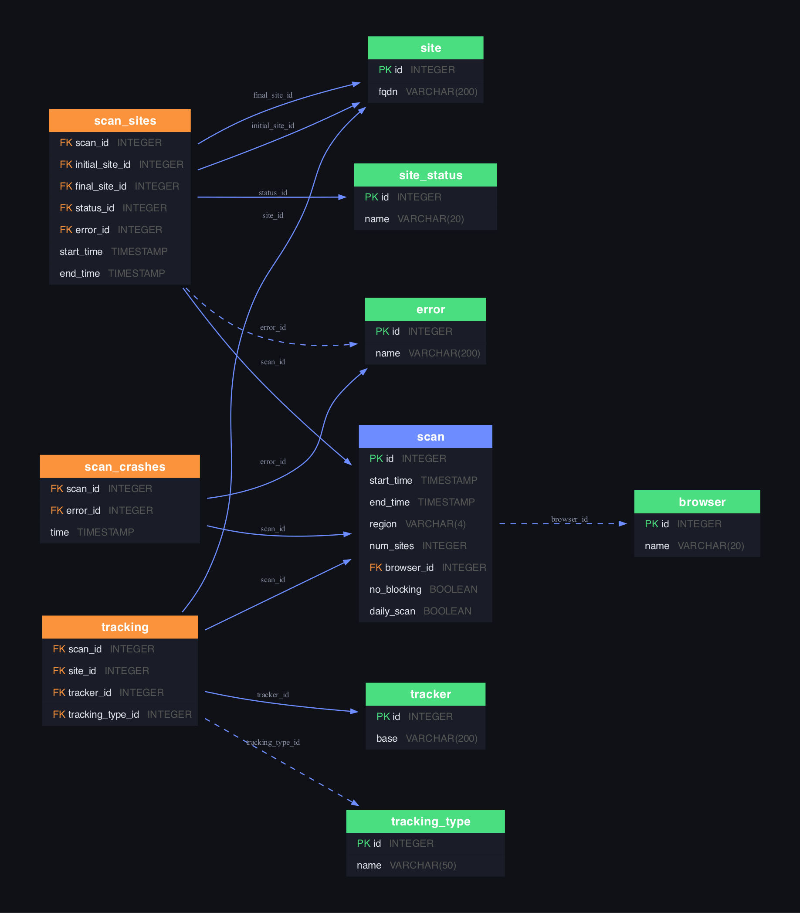

# Badger Sett Database Reference

## Entity-Relationship Diagram



Color key: 🟢 Green = lookup/reference tables, 🔵 Blue = core tables, 🟠 Orange = junction/fact tables. Dashed lines = nullable foreign keys.

### Relationship Summary

| From | To | Relationship | Description |
|---|---|---|---|
| scan | browser | Many → One | Each scan uses one browser |
| scan_sites | scan | Many → One | Each scan visits many sites |
| scan_sites | site (×2) | Many → One | Initial URL and final URL after redirects |
| scan_sites | site_status | Many → One | Visit outcome (success/timeout/error/antibot) |
| scan_sites | error | Many → One | Error details (nullable, only for failed visits) |
| scan_crashes | scan | Many → One | Browser crashes during a scan |
| scan_crashes | error | Many → One | Crash error description |
| tracking | scan | Many → One | Tracking observed during a scan |
| tracking | site | Many → One | The site being visited |
| tracking | tracker | Many → One | The third-party tracker domain |
| tracking | tracking_type | Many → One | How tracking was detected (nullable) |

---

## Table Details & Sample Data

### browser
Browsers used for scanning.

| id | name |
|---|---|
| 1 | firefox |
| 2 | chrome |
| 3 | edge |

---

### site_status
Possible outcomes when visiting a site.

| id | name |
|---|---|
| 1 | success |
| 2 | timeout |
| 3 | error |
| 4 | antibot |

---

### tracking_type
Methods used to detect tracking behavior.

| id | name |
|---|---|
| 1 | beacon |
| 2 | canvas |
| 3 | pixelcookieshare |

---

### scan
Each row is one complete crawl run across thousands of sites.

| id | start_time | end_time | region | num_sites | browser_id | no_blocking | daily_scan |
|---|---|---|---|---|---|---|---|
| 1 | 2026-04-25 12:00:38 | 2026-04-26 08:49:11 | sfo1 | 6000 | 3 (edge) | 0 | 1 |
| 2 | 2026-04-24 12:00:37 | 2026-04-25 09:22:27 | sfo1 | 7100 | 1 (firefox) | 1 | 1 |
| 3 | 2026-04-23 12:00:38 | 2026-04-24 09:33:06 | sfo1 | 6600 | 2 (chrome) | 0 | 1 |

- `no_blocking`: 1 = Privacy Badger blocking disabled (control scan), 0 = normal
- `daily_scan`: 1 = automated daily scan, 0 = distributed/swarm scan

---

### site
Websites visited during scans.

| id | fqdn |
|---|---|
| 1 | automattic.com |
| 2 | americanas.com.br |
| 3 | lazada.co.id |
| 4 | romarg.com |
| 5 | misli.az |

---

### tracker
Third-party domains observed performing tracking.

| id | base |
|---|---|
| 1 | 04xmhp.ru |
| 2 | 094kk.com |
| 3 | 163.com |
| 4 | 21cn.com |
| 5 | 24hstatic.com |

---

### scan_sites
Per-site visit results within a scan. Tracks the initial URL, final URL (after redirects), status, timing, and any errors.

| scan_id | initial_site | final_site | status | error | start_time | end_time |
|---|---|---|---|---|---|---|
| 1 | automattic.com | automattic.com | success | — | 2026-04-25 12:00:56 | 2026-04-25 12:01:02 |
| 1 | americanas.com.br | americanas.com.br | success | — | 2026-04-25 12:01:02 | 2026-04-25 12:01:15 |
| 1 | nyt.com | nytimes.com | success | — | 2026-04-25 12:02:29 | 2026-04-25 12:02:57 |
| 1 | stradivarius.com | stradivarius.com | antibot | Reached Akamai security page | 2026-04-25 12:09:48 | 2026-04-25 12:09:48 |
| 1 | onamae.com | onamae.com | antibot | Reached Cloudflare security page | 2026-04-25 12:13:41 | 2026-04-25 12:13:41 |

Note: `initial_site_id` and `final_site_id` both reference `site.id`. When a site redirects (e.g. nyt.com → nytimes.com), they differ.

---

### scan_crashes
Browser crashes/restarts that occurred during a scan.

| scan_id | browser | error | time |
|---|---|---|---|
| 1 | edge | Extension timeout | 2026-04-25 18:56:22 |
| 1 | edge | Extension timeout | 2026-04-26 02:57:41 |
| 1 | edge | failed to close window in 20 seconds | 2026-04-26 03:13:01 |

---

### tracking
The core data: which tracker was seen on which site during which scan.

| scan_id | site | tracker | tracking_type |
|---|---|---|---|
| 1 | profi.ru | 04xmhp.ru | unknown |
| 1 | zhihu.com | 163.com | unknown |
| 1 | nos.nl | 2cnt.net | beacon |
| 1 | tvspielfilm.de | 2cnt.net | unknown |
| 1 | 1filmyfly.mov | 094kk.com | unknown |

---

### error
Distinct error messages encountered during scans.

| id | name |
|---|---|
| 1 | WebDriverException: Reached Akamai server security page |
| 2 | WebDriverException: Reached Cloudflare security page |
| 3 | WebDriverException: unknown error: net::ERR_NAME_NOT_RESOLVED |
| 4 | WebDriverException: unknown error: net::ERR_CONNECTION_REFUSED |
| 5 | WebDriverException: Reached error page: ERR_EMPTY_RESPONSE |

---

## Useful Queries

### Top 10 most prevalent trackers (last 365 days)
```sql
SELECT t.base, COUNT(DISTINCT tr.site_id) AS sites_tracked
FROM tracking tr
JOIN tracker t ON t.id = tr.tracker_id
JOIN scan s ON s.id = tr.scan_id
WHERE s.start_time >= date('now', '-365 days')
GROUP BY t.base
ORDER BY sites_tracked DESC
LIMIT 10;
```

### Sites with the most trackers (latest scan)
```sql
SELECT si.fqdn, COUNT(DISTINCT tr.tracker_id) AS tracker_count
FROM tracking tr
JOIN site si ON si.id = tr.site_id
WHERE tr.scan_id = (SELECT MAX(id) FROM scan)
GROUP BY si.fqdn
ORDER BY tracker_count DESC
LIMIT 20;
```

### Tracker prevalence trend over time
```sql
SELECT strftime('%Y-%m', s.start_time) AS month,
       COUNT(DISTINCT tr.site_id) AS sites
FROM tracking tr
JOIN scan s ON s.id = tr.scan_id
JOIN tracker t ON t.id = tr.tracker_id
WHERE t.base = 'google.com'
GROUP BY month
ORDER BY month;
```

### Site visit success rate by browser
```sql
SELECT b.name AS browser,
       ROUND(100.0 * SUM(CASE WHEN ss.name = 'success' THEN 1 ELSE 0 END) / COUNT(*), 1) AS success_pct,
       COUNT(*) AS total_visits
FROM scan_sites sc
JOIN scan s ON s.id = sc.scan_id
JOIN browser b ON b.id = s.browser_id
JOIN site_status ss ON ss.id = sc.status_id
GROUP BY b.name;
```

### Most common errors
```sql
SELECT e.name, COUNT(*) AS occurrences
FROM scan_sites sc
JOIN error e ON e.id = sc.error_id
GROUP BY e.name
ORDER BY occurrences DESC
LIMIT 10;
```

### Sites that redirect to a different domain
```sql
SELECT si1.fqdn AS original, si2.fqdn AS redirected_to, COUNT(*) AS times_seen
FROM scan_sites sc
JOIN site si1 ON si1.id = sc.initial_site_id
JOIN site si2 ON si2.id = sc.final_site_id
WHERE sc.initial_site_id != sc.final_site_id
GROUP BY si1.fqdn, si2.fqdn
ORDER BY times_seen DESC
LIMIT 20;
```
